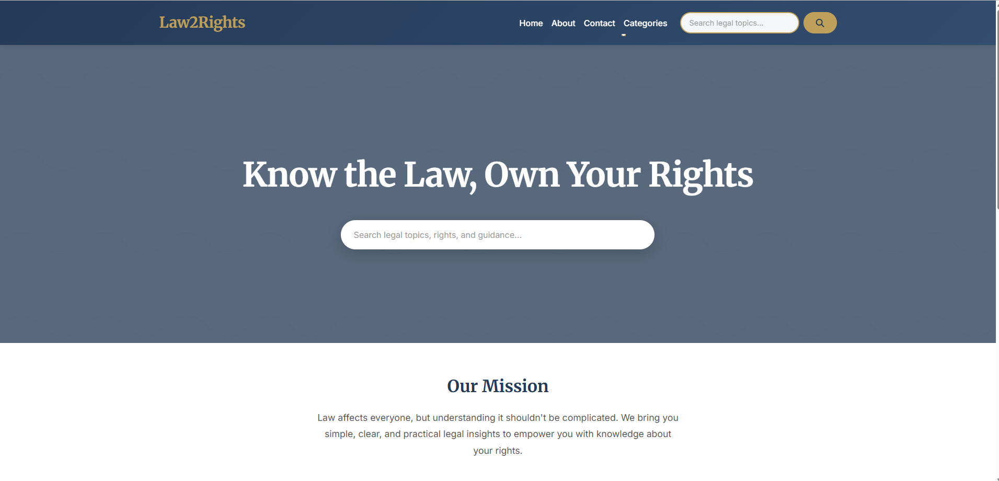

# ⚖️ Law2Rights — Know the Law, Own Your Rights!

> A modern, comprehensive Legal Awareness Platform and CMS built with Django.

[](https://www.djangoproject.com/)
[](https://www.python.org/)
[](https://getbootstrap.com/)

## 📖 About The Project

**Law2Rights** is a legal content management system designed to simplify complex legal concepts for common citizens and law students. It features a robust blog engine, legal dictionary, and exam preparation resources.

### ✨ Key Features
*   **Modern UI/UX:** Fully responsive design using **Bootstrap 5**.
*   **Interactive Content:** Dynamic blog cards, hover effects, and legal case summaries.
*   **Advanced Admin Panel:** Customized dashboard using **Django Jazzmin** for easy content management.
*   **Rich Text Editing:** Integrated **CKEditor** for writing beautiful legal articles.
*   **Search Functionality:** Global search to find acts, articles, and exam tips.
*   **Category Management:** Organized content (Indian Penal Code, Constitution, Career Guidance).

---

## 📸 Screenshots

| **Home Page** | **Admin Dashboard** |
|:---:|:---:|
|  |
*(Add your screenshots to a folder named `screenshots` and update these paths)*

---

## 🛠️ Tech Stack
*   **Backend:** Python, Django Framework
*   **Frontend:** HTML5, CSS3, JavaScript, Bootstrap 5
*   **Database:** SQLite (Development) / PostgreSQL (Production ready)
*   **Utilities:** Pillow (Image handling), Django Crispy Forms

---

## 🚀 Quick Start Guide (Windows)

Follow these steps to set up the project locally on your machine.

### 1. Clone the Repository
```powershell
git clone https://github.com/PYTHONrohit7/law2right.git
cd law2right
